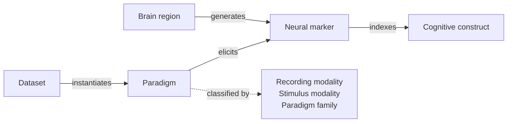

# BCI Paradigm Atlas

**English** | [简体中文](README.zh-CN.md)

An open, structured and citable atlas of brain-computer interface (BCI) paradigms and the neural knowledge behind them, initiated and maintained by **思维刻度 SavorCode**.

> **First proposed by 思维刻度 SavorCode.** To our knowledge, this is the first attempt to organise BCI paradigms and their neural basis into a single, evidence-graded knowledge graph, and the first proposal to turn paradigm design into an engineered, knowledge-driven production process. 

The atlas has two layers:

- **Paradigm catalog**: experimental paradigms used to elicit and acquire brain signals, across recording modalities (EEG, MEG, fNIRS, fMRI, ECoG, intracortical and others) and stimulus or task modalities (visual, auditory, somatosensory, electrical and magnetic stimulation, imagery and others), each traced to its original publication.
- **Neural knowledge base**: the neural markers these paradigms elicit, the brain regions that generate them, and the cognitive constructs they index, with every link backed by literature and graded by strength of evidence.

Together they form a knowledge graph that answers three questions for any paradigm: *what does it elicit, where does that signal come from, and what can it actually tell us about the brain?*

## Concepts

**BCI Paradigm Atlas.** A unified map of how the brain is questioned in BCI research. Instead of listing paradigms alone, the atlas links each paradigm to the neural markers it elicits, the brain regions that generate them and the cognitive constructs they index, and grades the evidence behind every link. It turns scattered, implicit knowledge into an explicit, machine-readable and verifiable resource.

**BCI Paradigm Factory.** An engineering approach to paradigm design, built on the atlas. Where paradigms have traditionally been designed by hand, one study at a time, the Paradigm Factory generates, validates and runs them systematically, using the knowledge graph as a prior and feeding every result back into it. It is SavorCode's core platform.

## Motivation

Every BCI begins with a paradigm: a stimulus, a task and a timing scheme that determine which brain states are elicited and therefore what the recorded data can contain. Decoders and foundation models can only learn from states that were elicited in the first place.

Despite this, the paradigm layer of the field remains poorly organised:

1. **Fragmented knowledge.** Paradigms are described across decades of literature, multiple modalities and lab-specific conventions. The same paradigm appears under different names; variants are rarely traced back to their origin.
2. **Implicit neural assumptions.** The link from a paradigm to a neural marker, and from that marker to a cognitive construct, is usually assumed rather than documented. The strength of evidence behind each link is seldom made explicit.
3. **Concentrated coverage.** Public BCI datasets cluster around a small set of paradigms such as motor imagery, SSVEP and P300. Without a systematic map, it is difficult to see which constructs and modalities remain unexplored.

The atlas makes this layer explicit, machine-readable and open to verification.

## Data model



| Entity | Identifier | Location | Example |
|---|---|---|---|
| Paradigm | `PER-ODD-001` | `paradigms/<family>/` | Oddball paradigm |
| Neural marker | `MK.*` | `knowledge/markers/` | `MK.P3b`, `MK.SMR_ERD` |
| Brain region | `BR.*` | `knowledge/regions.yaml` | `BR.sensorimotor_cortex` |
| Cognitive construct | `CN.*` | `knowledge/constructs.yaml` | `CN.context_updating` |

Every *generates* and *indexes* link carries a source and an evidence grade (A–D). Paradigm entries record the earliest publication, key variants, public datasets, BCI category (active, reactive or passive) and mappings to existing standards: BIDS task names, HED tags and Cognitive Atlas concepts. Definitions, inclusion criteria and grading rules are documented in [docs/methodology.md](docs/methodology.md).

## Repository layout

```
paradigms/     Paradigm entries, one YAML file per paradigm, grouped by family
knowledge/     Neural markers, brain regions and cognitive constructs
taxonomy/      Controlled vocabularies (modalities, families, marker types, evidence grades)
schema/        JSON Schemas for all entry types
scripts/       Validation and graph export
docs/          Methodology
paper/         Source of the accompanying review paper
```

## Using the data

```bash
pip install -r scripts/requirements.txt
python scripts/validate.py        # schema and cross-reference checks
python scripts/build_graph.py     # exports dist/graph.json and prints coverage statistics
```

`dist/graph.json` contains all nodes and edges of the knowledge graph and can be loaded into any graph library or database.

## Status

The atlas is in its seeding phase. The schemas (v0.1) and vocabularies are drafts and may change before v1.0. Seed entries are marked `draft` until their sources have been verified against the original publications.


## Relation to the Paradigm Factory

The atlas is the open knowledge base of the **Paradigm Factory**, the core platform developed by SavorCode. The Paradigm Factory uses the knowledge graph as a prior to generate and validate new paradigms and to run them on any acquisition hardware, then feeds the results back into the graph, so that each experiment improves the next.

It rests on a simple premise: **the paradigm sets the upper bound of what brain data can contain.** As BCI moves from hardware and decoding toward large-scale data and foundation models, the diversity and quality of the questions asked of the brain become the limiting factor. The Paradigm Factory is designed to remove that limit.

The first version of the Paradigm Factory is scheduled for **late October 2026**, followed by a data-acquisition validation phase.

## Roadmap

| Version | Target | Content |
|---|---|---|
| v0.0.1 | 1 Oct 2026 | Initial release and first public statement of the BCI Paradigm Atlas and Paradigm Factory concepts |
| — | Late Oct 2026 | Paradigm Factory first version |
| v0.1.x | Q4 2026 | Systematic seeding of paradigms and markers across modalities |
| v1.0.0 | TBD | Atlas v1 frozen; review paper made public |

Versions follow [Semantic Versioning](https://semver.org). See [CHANGELOG.md](CHANGELOG.md).

## Contributing

Contributions of new paradigms, markers, corrections and evidence are welcome. See [CONTRIBUTING.md](CONTRIBUTING.md).

## License and copyright

Copyright © 2026 思维刻度 SavorCode.
