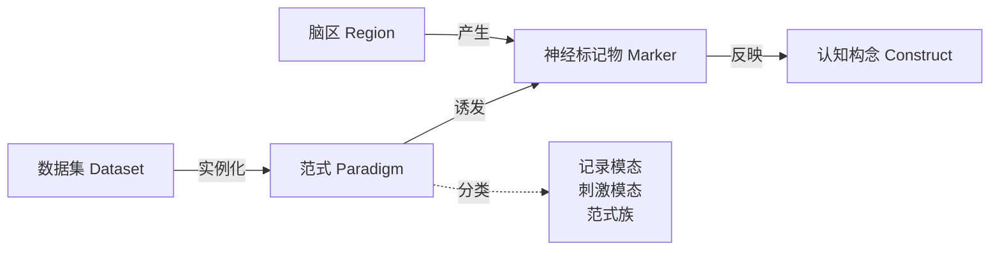

# 脑机接口范式图谱 BCI Paradigm Atlas

[项目展示页](https://savorcode-website.vercel.app/) · [Website source](website/)

[English](README.md) | **简体中文**

一个开放、结构化、可引用的脑机接口（BCI）范式及其神经知识图谱，由**思维刻度 SavorCode** 发起并维护。

> **由思维刻度首次提出。** 据我们所知，这是业内首次将脑机范式及其神经机制整合为一张证据分级的知识图谱，也是首次提出将范式设计转变为知识驱动、工程化的生产流程。

图谱分为两层：

- **范式目录**：用于诱发和采集脑信号的实验范式，覆盖各类记录模态（EEG、MEG、fNIRS、fMRI、ECoG、皮层内记录等）和刺激/任务模态（视觉、听觉、体感、电刺激、磁刺激、想象等），每个范式都追溯到其原始文献。
- **神经知识库**：这些范式诱发的神经标记物、产生标记物的脑区、标记物所反映的认知构念；每一条关联都有文献支撑，并按证据强度分级。

两层共同构成一张知识图谱，对任意一个范式回答三个问题：*它诱发了什么信号，这个信号从哪里产生，它究竟能告诉我们大脑的什么？*

## 核心概念

**脑机范式图谱（BCI Paradigm Atlas）**。一张描述脑机接口研究“如何向大脑提问”的统一图谱。它不止罗列范式，而是将每个范式与其诱发的神经标记物、产生标记物的脑区、标记物所反映的认知构念关联起来，并对每一条关联的证据强度分级，把分散、隐含的领域知识变成明确、机器可读、可验证的公共资源。

**范式工厂（BCI Paradigm Factory）**。建立在图谱之上的范式设计工程方法。传统范式依赖研究者逐项手工设计，范式工厂则以知识图谱为先验，系统地生成、校验并执行范式，每一次结果都回流到图谱中。它是思维刻度的核心平台。

## 背景与动机

任何脑机接口都始于一个范式：刺激、任务与时序共同决定了被诱发的脑状态，也就决定了采集到的数据能包含什么。解码算法和基座模型，只能从被诱发过的脑状态中学习。

然而，范式这一层在领域内仍缺乏系统整理：

1. **知识分散**。范式散见于几十年的文献、多种模态和各实验室的习惯中。同一范式名称不一，变体也很少追溯到源头。
2. **神经假设隐含**。从范式到神经标记物、再从标记物到认知构念的关联，往往是默认的而非有据可查的，每条关联的证据强度也很少被明确说明。
3. **覆盖集中**。公开脑机数据集集中在运动想象、SSVEP、P300 等少数范式上。缺少系统的全景图，就很难看清哪些认知构念和模态仍是空白。

本图谱的目标，是让这一层变得明确、机器可读、可被验证。

## 数据模型



| 实体 | 标识符 | 位置 | 示例 |
|---|---|---|---|
| 范式 | `PER-ODD-001` | `paradigms/<范式族>/` | Oddball 范式 |
| 神经标记物 | `MK.*` | `knowledge/markers/` | `MK.P3b`、`MK.SMR_ERD` |
| 脑区 | `BR.*` | `knowledge/regions.yaml` | `BR.sensorimotor_cortex` |
| 认知构念 | `CN.*` | `knowledge/constructs.yaml` | `CN.context_updating` |

每一条“产生”与“反映”关联都附有出处和证据等级（A–D）。范式条目记录最早的文献、主要变体、公开数据集、脑机接口类别（主动式、反应式、被动式），以及与现有标准的映射：BIDS 任务名、HED 标签和 Cognitive Atlas 概念。定义、纳入标准和分级规则详见 [docs/methodology.zh-CN.md](docs/methodology.zh-CN.md)。

## 目录结构

```
paradigms/     范式条目，每个范式一个 YAML 文件，按范式族分组
knowledge/     神经标记物、脑区与认知构念
taxonomy/      受控词表（模态、范式族、标记物类型、证据等级）
schema/        各类条目的 JSON Schema
scripts/       校验与图谱导出
docs/          方法说明
paper/         配套综述论文源码
```

## 数据使用

```bash
pip install -r scripts/requirements.txt
python scripts/validate.py        # schema 与交叉引用校验
python scripts/build_graph.py     # 导出 dist/graph.json 并输出覆盖统计
```

`dist/graph.json` 包含知识图谱的全部节点与边，可直接导入任意图计算库或图数据库。

## 当前状态

v0.1.0（2026 年 10 月 8 日）收录 12 个范式族的 267 个范式类、405 个具体范式（404 个有效，均有协议）与 129 个神经标记物。全部 682 条源头已与 Crossref / OpenAlex 完成书目核实，对照原文的内容核实是下一步，因此所有条目仍为 `draft`。自本版起标识符含义冻结。schema 0.2（范式采用范式类与具体范式两级标识符）与词表均为草案，v1.0 之前可能调整。发布说明见 [curation/reports/release_v0.1.0.md](curation/reports/release_v0.1.0.md)。

## 与范式工厂的关系

本图谱是**范式工厂**的开放知识底座。范式工厂是思维刻度自主研发的核心平台，以本图谱为先验生成、校验新范式，在任意采集硬件上执行，并将结果回流到图谱中，让每一次实验都使下一次提问更准确。

它基于一个核心判断：**范式决定了脑数据所能包含内容的上限**。当脑机接口的重心从硬件、解码算法走向大规模数据与基座模型，向大脑提出的问题是否足够多样、足够精准，正在成为新的瓶颈。范式工厂正是为突破这一瓶颈而设计。

范式工厂首个版本计划于 **2026 年 10 月底**发布，随后进入数采验证期。

## 路线图

| 版本 | 时间 | 内容 |
|---|---|---|
| v0.0.1 | 2026 年 10 月 1 日 | 初始发布，脑机范式图谱与范式工厂概念首次公开 |
| v0.1.0 | 2026 年 10 月 8 日 | 267 个范式类、405 个带协议的具体范式，两级标识符，682 条源头完成书目核实 |
| — | 2026 年 10 月底 | 范式工厂首个版本发布 |
| v0.2.x | 2026 年第四季度 | 对照原文的源头内容核实；schema 0.3 提议 |
| v1.0.0 | 待定 | 图谱 v1 冻结，综述论文公开 |

版本号遵循[语义化版本](https://semver.org/lang/zh-CN/)，变更记录见 [CHANGELOG.md](CHANGELOG.md)。

## 参与贡献

欢迎贡献新的范式、神经标记物、修正与证据，详见 [CONTRIBUTING.md](CONTRIBUTING.md)。

## 许可与版权

Copyright © 2026 思维刻度 SavorCode。
